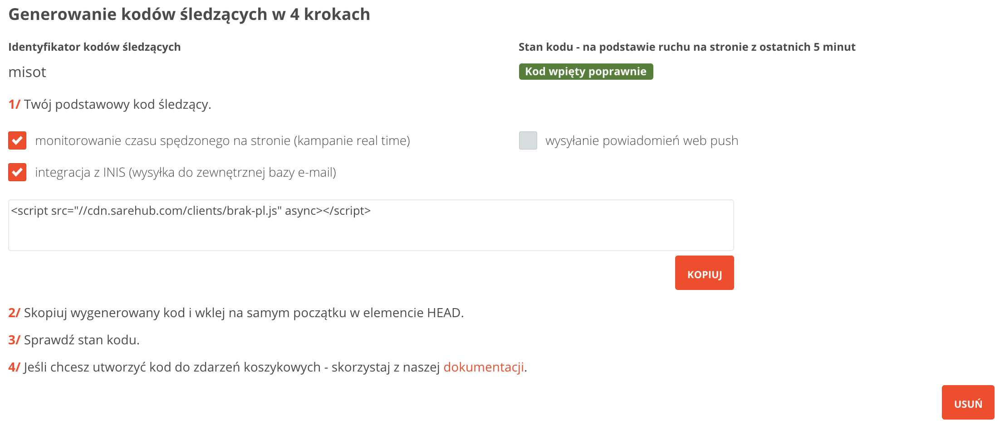

############################
Kod śledzący
############################

Podstawowy kod śledzący
=======================================

Kod śledzący należy wstawić w kodzie źródłowym strony internetowej (pamiętając o podmianie identyfikatora wewnątrz kodu):

.. code-block::  HTML

    

