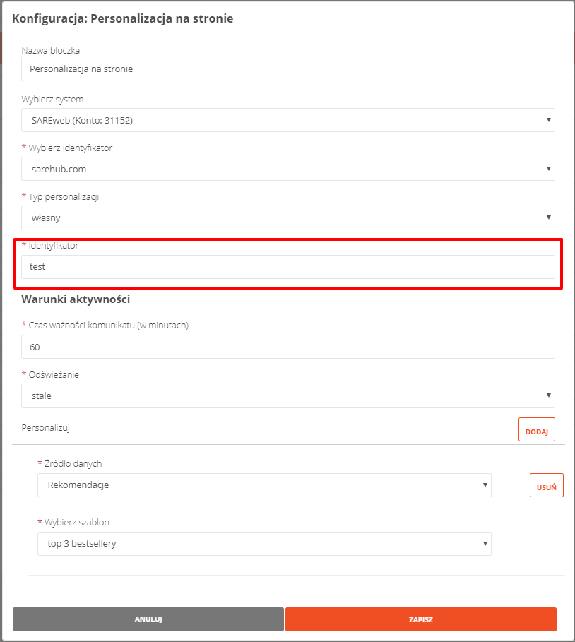

Personalizacja na stronie
=======================================

Podstawowy kod śledzący SAREweb, który należy wstawić stronie internetowej należy wzbogacić o dwa dodatkowe parametry **personalization_subject** oraz **personalization_callback**.

Przykład:

.. code-block:: javascript

    (function (p){window['sareX_params']=p;var s=document.createElement('script');
    s.src='//x.sare25.com/libs/sarex4.min.js';s.async=true;var t=document.getElementsByTagName('script')[0];
    t.parentNode.insertBefore(s,t);
    })({
      domain : 'brak.pl',
      personalization_callback: personalization_handler,
      personalization_subject: ["test"]
    });

    function personalization_handler(msg){
        if (msg.params.body.SAREhub_1_100_1_id) {
            var img = document.createElement("img");
            img.setAttribute("src", msg.params.body.SAREhub_1_100_1_image);
            img.setAttribute("height", "200");
            img.setAttribute("width", "200");

            var text = document.createTextNode(msg.params.body.SAREhub_1_100_1_name);

            document.getElementById("product1").appendChild(text);
            document.getElementById("product1").appendChild(img);
        }
    }

- **personalization_callback** - funkcja callback przygotowana w Javascript, która wyzwoli personalizację. Do funkcji zostanie przekazana wiadomość z personalizacją np. rekomendowane produkty. Przykład wiadomości personalizacyjnej:

.. code-block:: javascript

    {
      "type": "message",
      "time": 1558961608,
      "user": {
        "cookie": "123xxxxxxxx"
      },
      "params": {
        "domain": "brak.pl",
        "expire": "600",
        "type": "once",
        "subject": "shoper",
        "body": {
          "SAREhub_1_100_1_id": "3",
          "SAREhub_1_100_1_name": "Półbuty Nikipol, skórzane",
          "SAREhub_1_100_1_image": "https://via.placeholder.com/150",
          "SAREhub_1_100_2_id": "5",
          "SAREhub_1_100_2_name": "Półbuty zamszowe Nikopol",
          "SAREhub_1_100_2_image": "https://via.placeholder.com/150"
        },
        "hub_id": "1"
      }
    }

- **personalization_subject** - tablica stworzonych wcześniej w panelu SAREhub dowolny identyfikatorów personalizacji (bloczek **Personalizacja na stronie**). Pozwala na personalizowanie konkretnej podstrony.

Parametr jest tablicą co umożliwia podanie kilku identyfikatorów personalizacji jednocześnie. W przypadku gdy użytkownik powienien otrzymać kilka wiadomości personalizacyjnych funkcja personalization_callback wywoła się osobno dla każdej wiadomości.

Do prawidłowego działania personalizacji wymagane jest ustawienie takich samych identyfikatrów zarówno w kodzie jak i bloczku **Personalizacja na stronie**.

Brak zdefiniowania paremetru **personalization_subject** spowoduje pobranie wszystkich możliwych wiadomości dla danego użytkownika.

